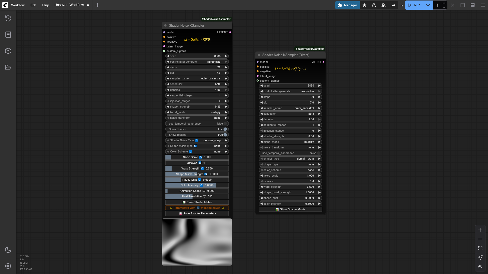

# ComfyUI-ShaderNoiseKSampler


**Transform AI image generation from random sampling into deliberate navigation through mathematical topologies.**

ComfyUI-ShaderNoiseKSampler is an advanced custom KSampler node that replaces standard noise generation with a multi-stage shader-based system. Unlike traditional sampling that teleports randomly between different seeds, this tool provides a structured vehicle for exploring the neighborhood around a chosen seed, using mathematical patterns to navigate along coherent paths through latent space.

> [!TIP]
> Perfect for artists and researchers looking to explore the latent space with more intention, sculpt image features with mathematical precision, and achieve unique visual styles through deliberate exploration rather than random discovery.




## 🧭 Navigating the Seed Universe

Think of standard image generation, where you try different seeds, as driving from one town to another. Each new seed takes you to a completely different town.

The ShaderNoiseKSampler works differently. It's like picking one town (one specific seed) that you find particularly interesting, and instead of just driving through to the next one, you decide to stop, get out of the car, and really explore *that specific town*. You can wander down its hidden alleyways, check out its diverse neighborhoods, and discover all the unique details and variations it holds. 

The shader noise is your map and the shader parameters (like Noise Scale, Octaves, Warp Strength, etc.) are your compass for this in-depth local exploration:

- **🔍 Noise Scale: The Zoom Control** - Determines how "zoomed in" or "zoomed out" you are in latent space
- **🔬 Octaves: The Detail Slider** - Controls the level of detail and complexity in your noise pattern
- **🌀 Warp Strength: The Non-Linear Navigator** - Creates non-linear paths through latent space
- **🔄 Phase Shift: The Perspective Shifter** - Reveals different "facets" of the same core elements

The core innovation is treating latent space as a territory to be explored rather than a lottery to be played - turning the act of AI image generation into a journey of deliberate artistic discovery guided by the elegant language of mathematical patterns.

## 🔮 The Innovation: Controllable Noise

While traditional samplers rely on pure randomness, **ShaderNoiseKSampler** introduces a paradigm shift: mathematically controllable noise patterns derived from shader technology (shader noise). This isn't just navigation - it's the invention of a new vehicle.

By replacing the standard random noise distribution with structured shader-generated patterns (shader noise), we transform the diffusion process from a random walk into a deliberate journey. The noise itself becomes an artistic medium you can sculpt through mathematical parameters:

- Scale, octaves, and warp create precise noise topographies
- Transformations and blending modes give you noise "vocabulary"
- Shape masks and color schemes provide spatial and frequency control

This controlled noise approach bridges the gap between the deterministic world of procedural generation and the probabilistic nature of diffusion models, offering creative control without sacrificing the generative AI's creative potential.

## 📖 The Shader Matrix: In-Depth Documentation

A core feature of this project is the **"📊 Show Shader Matrix"** button available on the `ShaderNoiseKSampler` (and related) nodes. Clicking this button opens an extensive, self-contained modal dialog—The Shader Matrix—which provides:

-   Detailed explanations of all shader noise types, mathematical foundations, and parameters.
-   Interactive visualizations of noise patterns and shape masks.
-   Python code examples for noise generation.
-   A comprehensive guide to the philosophy and usage of the node.

This README provides an overview, but the Shader Matrix is your ultimate guide for deep dives!

## ✨ Features


*(Suggestion: Replace with a screenshot of the ShaderNoiseKSampler node interface.)*

-   **🚀 Advanced KSampler Replacement**: Integrates directly into your workflow as a KSampler.
-   **🔬 Multi-Stage Shader Application**:
    -   **Sequential Stages**: Apply shader noise over segments of the diffusion process.
    -   **Injection Stages**: Apply shader noise at specific, discrete steps.
-   **🎨 Twelve Shader Noise Archetypes**: Explore a vast range of patterns:
    -   Tensor Field, Cellular, Domain Warp, Fractal (FBM), Perlin, Waves, Gaussian, Heterogeneous FBM, Interference, Spectral, 3D Projection, Curl Noise.
-   **🎭 Sophisticated Blending & Transformations**:
    -   **Blend Modes**: Combine shader noise with base noise using modes like Multiply, Add, Overlay, Screen, Soft Light, Hard Light, Difference.
    -   **Noise Transformations**: Apply mathematical operations (Absolute, Sin, Square Root, etc.) to shader noise before blending.
-   **💠 Shape Masks**: Spatially modulate noise with geometric overlays (Radial, Linear, Grid, Vignette, Spiral, Hexgrid, etc.) with adjustable strength.
-   **🌈 Color Schemes Integration**: Apply color transformations (Inferno, Magma, Viridis, Jet, Turbo, etc.) to the noise *before* it influences the diffusion model, subtly guiding structure and aesthetics. Adjustable intensity.
-   **⏳ Temporal Coherence**:
    -   Generate frame-consistent evolving noise for animations.
    -   Ensure consistent base noise for predictable exploration when tweaking parameters for still images.
-   **🎛️ Granular Control**:
    -   Global `shader_strength` and per-stage strength tuning.
    -   Adjust `noise_scale`, `octaves`, `warp_strength`, `phase_shift`, and more for each stage.
-   **💾 Parameter Management**: Save your shader parameter configurations.
-   **📊 "Show Shader Matrix" Button**: Access comprehensive, interactive documentation and visualizations directly within ComfyUI (Alt+M shortcut).
-   **🤝 Compatibility**: Works with various models including SD 1.5, SDXL, WAN2.1, Hunyuan, and more (see Model Compatibility section).
-   **🧠 Latent Space Cartography**: Create a map of the territory surrounding your seed, developing an intuitive understanding of how to navigate to specific effects.
-   **🔄 Persistent Identities in Variation**: Observe how similar elements persist across parameter adjustments, revealing how the model encodes concepts and their relationships.
-   **💎 Discovery of "Hidden Gems"**: Find interesting variations that exist in the spaces "between" seeds that random sampling might statistically miss.

## 📥 Installation

### Option 1: Using ComfyUI Manager

1.  Install [ComfyUI Manager](https://github.com/ltdrdata/ComfyUI-Manager) if you don't have it already.
2.  Open ComfyUI, go to the **Manager** tab.
3.  Click on **Install Custom Nodes**.
4.  Search for "**ComfyUI-ShaderNoiseKSampler**" and click **Install**.
5.  Restart ComfyUI.

### Option 2: Manual Installation

```bash
cd /path/to/ComfyUI/custom_nodes
git clone https://github.com/AEmotionStudio/ComfyUI-ShaderNoiseKsampler.git
```

Restart ComfyUI after installation. No additional `pip install` steps are required for the core functionality.

## 🚀 Usage

1.  **Add Node**: Add the `ShaderNoiseKSampler` node to your ComfyUI graph.
2.  **Connect Inputs**:
    -   `model`: Your primary AI model.
    -   `positive`, `negative`: Your conditioning prompts.
    -   `latent_image`: The input latent (e.g., from an Empty Latent Image node).
3.  **Basic Sampling Parameters**:
    -   Set `seed`, `steps`, `cfg`, `sampler_name`, `scheduler`, and `denoise` as you would for a standard KSampler.
4.  **Configure Shader Noise**: This is where the exploration begins!
    -   **Stages**: Define `sequential_stages` and `injection_stages`.
    -   **Global Controls**: Set `shader_strength` (0.0 to disable shaders), `blend_mode`, and `noise_transform`.
    -   **Per-Stage Controls**: For each stage, configure:
        -   `shader_noise_type` (e.g., perlin, cellular)
        -   `noise_scale` (zoom control), `noise_octaves` (detail level), `noise_warp_strength` (non-linear navigation), `noise_phase_shift` (perspective shift)
        -   `shape_mask_type` and `shape_mask_strength`
        -   `color_scheme` and `color_intensity`
        -   Stage-specific `strength_multiplier`
    -   **Temporal Coherence**: Enable `use_temporal_coherence` for animations or consistent exploration.
5.  **Explore**: Use the "📊 Show Shader Matrix" button (or Alt+M) to better understand the noise patterns you're creating.
6.  **Generate**: Queue your prompt and witness the shader-guided generation!

> [!TIP]
> Start with a low `shader_strength` (e.g., 0.1-0.3) and a single `sequential_stage` to understand the impact of different noise types and parameters. Gradually increase complexity as you become more familiar with how each parameter navigates the latent space.

## 🧠 Latent Space Navigation

Unlike random seed exploration, the ShaderNoiseKSampler provides a methodical way to navigate the latent space:

- **Creative Control vs. Serendipity**: Find a balance between intentional direction and unexpected discovery. You're not precisely controlling the output, but you're not completely at the mercy of randomness either - you're steering through possibility space.

- **Frequency Domain Exploration**: The mathematical nature of this tool allows you to explore how different frequency patterns map to semantic features in the generated images, revealing fundamental patterns in how visual information is encoded in the model.

- **Methodical Discovery**: As you experiment with different parameter combinations, you'll develop an intuitive understanding of how they affect the output, allowing for more deliberate creative choices.

- **Fine-Grained Control**: You can introduce a wide spectrum of changes, from barely noticeable subtleties to more significant transformations. This gives you the flexibility to choose your desired degree of alteration, all while preserving the core meaning, motion, and recognizable objects (semantic elements) of the image.

## ⚙️ Configuration Options

The `ShaderNoiseKSampler` offers extensive control. Key parameters are listed below with their navigational significance. For an exhaustive list and explanations, please refer to the **"📊 Show Shader Matrix"** documentation within ComfyUI.

| Option                       | Description & Navigational Significance                                                                     | Default (Example) |
|------------------------------|-------------------------------------------------------------------------------------------------------------|-------------------|
| **`seed`**                   | Master seed for reproducibility. This is your "town" in the latent space universe.                          | `8888`            |
| **`steps`**                  | Number of sampling iterations.                                                                             | `20`              |
| **`cfg`**                    | Classifier-Free Guidance scale.                                                                            | `7.0`             |
| **`sampler_name`**           | E.g., `euler_ancestral`, `dpm_2_ancestral`.                                                                          | `euler_ancestral` |
| **`scheduler`**              | E.g., `normal`, `beta`, `simple`.                                                                   | `beta`            |
| **`denoise`**                | Denoising strength.                                                                                        | `1.0`             |
| **`sequential_stages`**      | Number of shader stages applied sequentially.                                                              | `1`               |
| **`injection_stages`**       | Number of shader stages injected at specific steps.                                                        | `0`               |
| **`shader_strength`**        | Global strength of shader noise influence (0.0 to disable).                                                | `0.3`             |
| **`blend_mode`**             | How shader noise combines with base noise (e.g., `multiply`, `add`).                                       | `multiply`        |
| **`noise_transform`**        | Math operation on shader noise (e.g., `none`, `absolute`, `sin`).                                          | `none`            |
| **`use_temporal_coherence`** | For consistent noise in animations or exploration.                                                         | `false`           |
| **`shader_noise_type (per stage)`** | The base pattern (e.g., `domain_warp`, `tensor_field`, `curl_noise`).                                          | `domain_warp`          |
| **`noise_scale (per stage)`**    | The "Zoom Control" - determines how "zoomed in" or "zoomed out" you are in latent space.                  | `1.0`             |
| **`noise_octaves (per stage)`**  | The "Detail Slider" - controls the level of detail and complexity in your noise pattern.                  | `1`               |
| **`noise_warp_strength (per stage)`** | The "Non-Linear Navigator" - creates non-linear paths through latent space.                          | `0.5`             |
| **`noise_phase_shift (per stage)`** | The "Perspective Shifter" - reveals different "facets" of the same core elements.                      | `0.5`             |
| **`shape_mask_type (per stage)`** | Geometric mask overlay (e.g., `radial`, `grid`).                                                         | `none`            |
| **`shape_mask_strength (per stage)`**| Intensity of the shape mask.                                                                           | `0.5`             |
| **`color_scheme (per stage)`**   | Color mapping for noise (e.g., `viridis`, `jet`).                                                        | `none`            |
| **`color_intensity (per stage)`**| Strength of the color scheme influence.                                                                  | `0.8`            |

### Sampler & Scheduler Compatibility

Generally, `ShaderNoiseKSampler` aims for broad compatibility. The following are often good starting points (refer to the Shader Matrix for more details):

-   **Recommended Samplers**: `euler_ancestral`, `dpm_2_ancestral`, `dpmppm_2_ancestral`, `lcm`
-   **Recommended Schedulers**: `beta` (often preferred), `normal`, `simple`, `kl_optimal`

### 🧱 Model Compatibility

The `ShaderNoiseKSampler` also aims to be compatible with a variety of models. Compatibility often depends on the model's latent channel structure. The node attempts to automatically detect the channel count for many common models.

| Model Family / Name                | Category     | Status                               | Channels (Expected) | Notes                                                                 |
| ---------------------------------- | ------------ | ------------------------------------ | ------------------- | --------------------------------------------------------------------- |
| SD 1.5 / SD_X4                     | Image        | Compatible                           | 4                   | Standard 4-channel models.                                            |
| SDXL / SDXL Refiner                | Image        | Compatible                           | 4                   | Standard 4-channel models.                                            |
| Stable Cascade B                   | Image        | Compatible                           | 4                   | Formerly "Stable Cascade (Decoder/Non-Prior)".                         |
| Stable Cascade (Prior)             | Image        | Compatible                           | 16                  | Higher channel count.                                                 |
| SD3                                | Image        | Compatible                           | 16                  | Higher channel count.                                                 |
| Flux.1 / Flux                      | Image        | Compatible                           | 16                  | Higher channel count.                                                 |
| HunyuanDiT                         | Image        | Compatible                           | 4                   | Standard 4-channel model, similar to SD1.5/SDXL.                      |
| Chroma                             | Image        | Compatible                           | 4                   | Assumed 4-channel VAE based on related models.                        |
| HiDream / Flow                     | Image        | Compatible                           | 16                  | Higher channel count.                                                 |
| WAN / Warp / Pixel / Anime (WAN2.1) | Video (3D)   | Compatible                           | 16                  | Higher channel count.                                                 |
| Mochi                              | Video (3D)   | Compatible                           | 12                  | May require specific handling.                                        |
| LTXV                               | Video (3D)   | Compatible                           | 128                 | Very high channel count. Special configuration or specific noise handling might be beneficial. |
| CosmosVideo / Cosmos1CV8x8x8       | Video (3D)   | Compatible                           | 16                  | Channel count confirmed.                                              |
| HunyuanVideo                       | Video (3D)   | Compatible                           | 16                  | Official docs mention a 16x VAE channel compression. Effective channels for noise may differ or require specific handling. |
| AnimateDiff (on SD 1.5)            | Video (3D)   | Compatible                           | 4                   | Uses 4 channels from the base SD 1.5 model.                           |
| Stable Video Diffusion (SVD)       | Video (3D)   | Compatible                           | 4                   | Latent diffusion model, likely 4 channels.                            |
| ACEStep / ACE                      | Audio (1D)   | Compatible                           | 8                   | Compatibility with 2D noise may vary.                               |
| StableAudio1                       | Audio (1D)   | Untested                             | 64                  | Compatibility with 2D noise is uncertain.                           |
| Hunyuan3Dv2                        | 3D Model     | Untested                             | 64                  | 1D channels. Compatibility with 2D noise is uncertain.              |
| Hunyuan3Dv2mini                    | 3D Model     | Untested                             | 64                  | 1D channels. Compatibility with 2D noise is uncertain.              |
| **Other Models**                   |              |                                      |                     |                                                                       |
| Generic 4-channel models           | Image        | Compatible (by default)              | 4                   | Most other standard diffusion models.                                 |
| Models with >16 channels (unlisted)| Various      | Untested / May Require Configuration | Varies              | Models with very high channel counts may require specific configurations or might exhibit different performance characteristics.                  |
| Other non-standard architecture    | Various      | Untested                             | Varies              | Results may vary.                                                     |

**Note on Channel Detection:** The `ShaderNoiseKSampler` includes logic to infer model channel counts (see `get_model_channel_count` in `shader_noise_ksampler.py`). If you encounter issues with a new or untested model, understanding its latent channel structure is important. For models with very high channel counts, performance or compatibility might vary, and specific noise generation approaches could be more suitable.

## 🔬 Shader Noise Deep Dive (Brief Overview)

The true depth of `ShaderNoiseKSampler` lies in its components. The "Shader Matrix" covers these extensively.

-   **Shader Noise Types**: Start your exploration with three powerful, freely available noise archetypes: `Domain Warp` for intricate, flowing distortions, `Tensor Field` for structured and directional patterns, and `Curl Noise` for smooth, fluid dynamics. Each offers a **unique visual lens** 🔭 for navigating latent space. ✨ **Additional advanced noise types** are available to supporters on [Ko-fi](https://ko-fi.com/aemotionstudio).
    *   `[Image: Domain Warp Noise Preview]`
    *   `[Image: Tensor Field Noise Preview]`
    *   `[Image: Curl Noise Preview]`
-   **Blend Modes**: Determine how the crafted shader noise interacts with the underlying base noise. `Multiply` can create depth, `Add` can introduce highlights, and `Overlay` can enhance contrast.
-   **Noise Transformations**: Apply mathematical functions like `absolute` (creates ridges), `sin` (creates bands), or `sqrt` (compresses highlights) to the raw shader noise before blending, dramatically altering its characteristics.
-   **Shape Masks**: Impose geometric forms onto your noise. A `radial` mask can create focus, a `grid` can introduce blocky structures. Strength is key.
-   **Color Schemes**: More than just a visual flair for the noise preview, these schemes (`viridis`, `inferno`, `jet`, etc.) transform the noise data itself. This "colored" noise can then guide the diffusion model in unique ways, influencing texture, features, and mood by altering how the model "perceives" the noise structure.

## ❓ Troubleshooting

-   **Shader Effects Not Visible**:
    -   Ensure `shader_strength` is greater than `0.0`.

-   **Unexpected Results**: Small parameter changes can sometimes lead to large visual shifts. Use the shader visualizer to understand the noise before generating. Experimentation is encouraged.

-   **Consult the Shader Matrix**: The in-app documentation is your best friend for detailed troubleshooting and understanding.

### Known Issues

-   **Optimal Use Cases**: The `ShaderNoiseKSampler` currently demonstrates its strongest capabilities in text-to-video and text-to-image generation. Performance with image-to-video or video-to-video workflows may not be as pronounced.

-   **Parameter Queuing with Non-Direct KSampler**: The standard (non-direct) `ShaderNoiseKSampler` node does not support queuing of differing parameter sets for consecutive runs i.e. you can't save over older parameters because their read at runtime. For rapid iteration and experimentation with varied parameters without needing to save each configuration, the `(direct) ShaderNoiseSampler` variant is recommended.

-   > [!WARNING]
    > **Potential for Visual Instability**: Certain parameter explorations, particularly with high intensity or complex interactions, may result in visually disruptive outputs such as flashing images or harsh artifacts. Users are advised to iterate with caution.

## 🌱 Research & Development Nature

ComfyUI-ShaderNoiseKSampler is born from dedicated personal research and investigation. While it introduces exciting ways to navigate latent space, please consider it an active exploration. This means there's a vast potential for further improvements, new discoveries, and community-driven enhancements as the project evolves. Your understanding of its current research-driven phase is appreciated!

### 🗺️ Roadmap: The Next Evolution

The journey into mathematically guided latent space exploration is just beginning. Here's a glimpse of what's on the horizon:

| Area                                            | Focus                                                                                                                                                                                                                                                           | Technologies Involved (Examples)          |
| :---------------------------------------------- | :-------------------------------------------------------------------------------------------------------------------------------------------------------------------------------------------------------------------------------------------------------------- | :---------------------------------------- |
| **🌌 Advanced Latent Space Cartography**        | Evolve current research into an intuitive "Visual Intent Engine". This system will allow users to express desired visual outcomes semantically (e.g., "enhance fabric texture," "shift lighting ambiance"). The engine will then intelligently translate these intents into optimal shader parameter configurations, fostering a more direct and expressive artistic workflow by deeply mapping the interplay between parameters and visual impact. | Semantic AI, Parameter Response Modeling, Machine Learning |
| **🎨 Expanded Shader Noise Palettes**          | Introduce a richer vocabulary of shader noise types, each with unique navigational properties and aesthetic fingerprints. Explore new dimensions of textural complexity, flow dynamics, and structural organization.                                       | Advanced Noise Algorithms, GLSL concepts  |
| **🧭 Precision Navigation Tools**               | Create more granular and predictable tools for manipulating latent pathways. Research direct correlations between mathematical noise constructs and emergent visual features for greater artistic intent.                                                    | Mathematical Modelling, Latent Space Analysis |
| **🔮 Cross-Modal Exploration**                  | Investigate applying structured noise principles to modalities beyond 2D images, such as 3D and audio, opening new avenues for creative exploration.                                                                                                | Signal Processing, Generative Models for Audio/3D |

Stay tuned to unlock new ways to interact with and understand the vast potential of generative models through the lens of controlled, mathematical noise.

## 🤝 Contributing

Contributions are welcome! Whether it's bug reports, feature suggestions, or pull requests, your help is appreciated.

1.  Fork the repository.
2.  Create a new branch (`git checkout -b feature/AmazingFeature`).
3.  Make your changes.
4.  Commit your changes (`git commit -m 'Add some AmazingFeature'`).
5.  Push to the branch (`git push origin feature/AmazingFeature`).
6.  Open a Pull Request.

## 🙏 Acknowledgements

-   The ComfyUI team for creating such a flexible and powerful platform.
-   The developers of libraries and concepts that inspired aspects of this work (e.g., GLSL, various noise algorithms).
-   The ComfyUI community for their continuous innovation and support.
-   Users and contributors who provide feedback and suggestions.

## 🔗 Connect with Æmotion (Developer)

-   YouTube: [AEmotionStudio](https://www.youtube.com/@aemotionstudio/videos)
-   GitHub: [AEmotionStudio](https://github.com/AEmotionStudio)
-   Discord: [Join our community](https://discord.gg/UzC9353mfp)
-   Website: [aemotionstudio.org](https://aemotionstudio.org/)

## ☕ Support

If you find ComfyUI-ShaderNoiseKSampler useful and wish to support its development, consider:

[](https://ko-fi.com/aemotionstudio)

Your support helps dedicate more time to maintaining and improving this project, developing new features, and creating better documentation and tutorials.

### 💖 Additional Ways to Support

-   ⭐ Star the repository on GitHub.
-   📢 Share it with others in the AI art community.
-   🛠️ Contribute to its development (see Contributing section).
-   💡 Provide feedback and feature requests.

For business inquiries or professional support, please contact me through my [website](https://aemotionstudio.org/) or join my [Discord server](https://discord.gg/UzC9353mfp).

## 📜 License

This project is licensed under the **GNU General Public License v3.0**.
See the `LICENSE` file for details (You may need to create this file if it doesn't exist, containing the GPL-3.0 license text). 